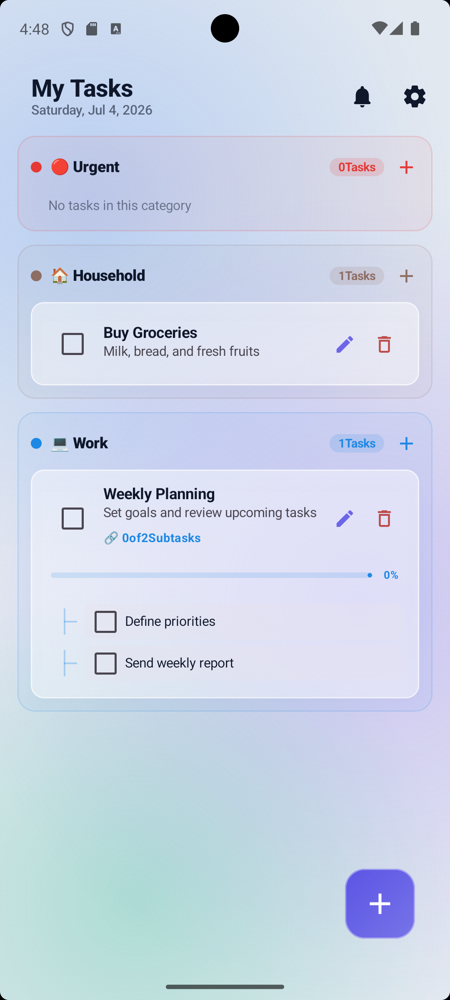

# ✨ My Tasks / کارهای من
### Intelligent Glassmorphism Todo App powered by Gemini AI

<div align="center">
  
  <br />
  <p align="center">
    <a href="https://kotlinlang.org/docs/home.html"></a>
    <a href="https://developer.android.com/jetpack/compose"></a>
    <a href="https://ai.google.dev/"></a>
    <a href="https://opensource.org/licenses/MIT"></a>
  </p>

  <h3>🚀 تجربه مدیریت هوشمند وظایف با هوش مصنوعی و طراحی مدرن شیشه‌ای</h3>
  
  <p dir="rtl">
    <b>کارهای من</b> یک اپلیکیشن مدرن و با کارایی بالا برای اندروید است که با <b>Kotlin</b> و <b>Jetpack Compose</b> توسعه یافته. این برنامه با تلفیق ابزارهای مدیریت وظایف سنتی و قدرت هوش مصنوعی <b>Gemini 1.5 Flash</b>، قابلیت منحصر به فرد "Magic Overlay" را برای ثبت وظایف به زبان عامیانه فراهم کرده است.
  </p>
</div>

---

## 📸 Visual Showcase / پیش‌نمایش گرافیکی

<div align="center">
  <table>
    <tr>
      <td width="25%"></td>
      <td width="25%"></td>
      <td width="25%"></td>
      <td width="25%"></td>
    </tr>
    <tr>
      <td align="center"><b>Dashboard</b><br/>پیشخوان</td>
      <td align="center"><b>Magic AI Entry</b><br/>ورودی جادویی</td>
      <td align="center"><b>Smart Settings</b><br/>تنظیمات هوشمند</td>
      <td align="center"><b>Manual Entry</b><br/>ثبت دستی</td>
    </tr>
  </table>
</div>

---

## 💎 Key Highlights / ویژگی‌های کلیدی

### 🧠 Magic AI Task Engine (موتور هوشمند AI)
**English:** Forget tedious forms. Long-press the FAB to activate the **Magic Overlay**. Parse complex sentences like: *"Gym tomorrow at 6 PM, buy groceries on Friday, and meeting with Ali next Monday"* instantly.

**فارسی:** فرم‌های طولانی را فراموش کنید. با نگه داشتن دکمه اصلی، ورودی جادویی باز می‌شود. جملاتی مثل *"فردا ۸ صبح نون بگیر، جمعه خرید میوه و شنبه ۵ عصر جلسه کاری"* را بنویسید تا هوش مصنوعی همه را استخراج و دسته‌بندی کند.

### 📅 Dual-Calendar Intelligence (تقویم دوگانه)
**English:** Native support for both **Jalali (Shamsi)** and **Gregorian** calendars. The UI dynamically adapts based on your selected language.

**فارسی:** پشتیبانی کامل و نیتیو از تقویم **شمسی** و **میلادی**. تمام بخش‌های برنامه از جمله انتخابگر تاریخ و یادآورها با تغییر زبان به صورت خودکار هماهنگ می‌شوند.

### 🎨 Glassmorphism UI (طراحی شیشه‌ای)
**English:** A stunning "Frosted Glass" interface built with custom Compose modifiers. Features mesh gradients and smooth micro-interactions.

**فارسی:** یک رابط کاربری خیره‌کننده با استایل شیشه‌ای مات که با مودیفایرهای اختصاصی Compose ساخته شده است. شامل گرادینت‌های Mesh و انیمیشن‌های بسیار نرم.

---

## 🛠 Engineering Stack / تکنولوژی‌ها

- **Language:** Kotlin 2.0
- **UI Framework:** Jetpack Compose (100%)
- **Database:** Room Persistence Library
- **AI:** Google AI SDK (Gemini 1.5 Flash)
- **Architecture:** MVVM + Repository Pattern
- **Date Logic:** Custom Jalali Calendar implementation
- **Concurrency:** Coroutines & Flow

---

## 🚀 Getting Started / شروع کار

### 1. AI Setup / تنظیم هوش مصنوعی
برای استفاده از قابلیت هوش مصنوعی:
1. یک کلید رایگان از **[Google AI Studio](https://aistudio.google.com/)** دریافت کنید.
2. در تنظیمات برنامه (⚙️) وارد کنید.

### 2. Build / نصب و اجرا
```bash
git clone https://github.com/your-username/my-tasks-ai.git
# Open in Android Studio Hedgehog or newer
# Sync Gradle and Run
```

---

## 🤝 Contribution & Support / مشارکت و حمایت

If you like this project, please give it a ⭐ to show your support! 
اگر این پروژه برای شما مفید بود، با دادن ستاره از آن حمایت کنید! ⭐

---

<div align="center">
  <p>Made with ❤️ for the Android Community • ساخته شده با ❤️ برای جامعه اندروید</p>
</div>
