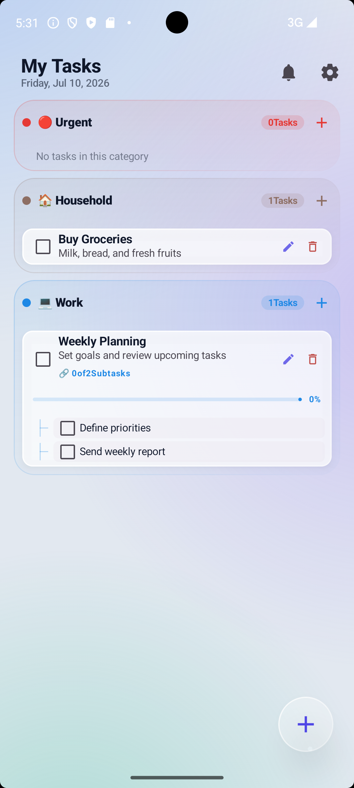
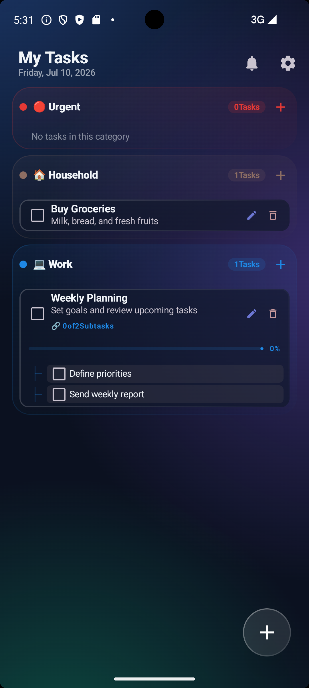
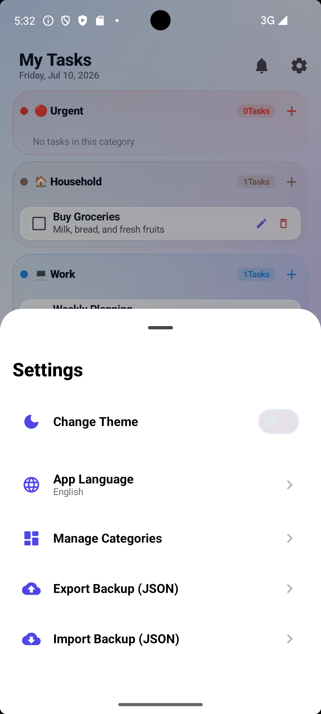
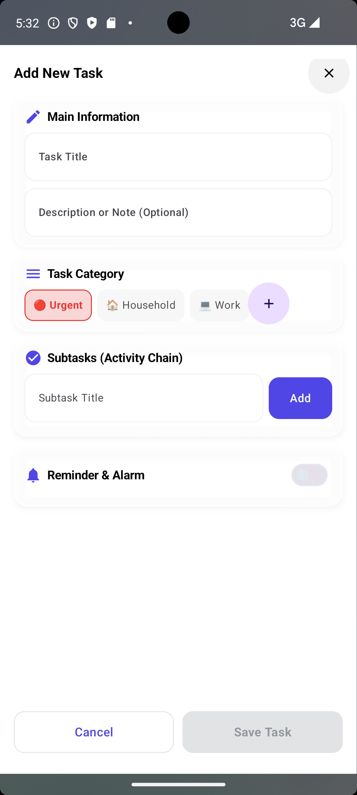

# ✨ My Tasks / کارهای من
### Ultra-Modern Glassmorphism Todo App for Android

<div align="center">
  
  <br />
  <p align="center">
    <a href="https://kotlinlang.org/docs/home.html"></a>
    <a href="https://developer.android.com/jetpack/compose"></a>
    <a href="https://opensource.org/licenses/MIT"></a>
  </p>

  <h3>🚀 مدیریت مدرن وظایف با طراحی خیره‌کننده شیشه‌ای</h3>
  
  <p dir="rtl">
    <b>کارهای من</b> یک اپلیکیشن مدیریت وظایف با کارایی بالا برای اندروید است که با تمرکز بر تجربه کاربری بصری و طراحی مدرن <b>Glassmorphism</b> توسعه یافته. این برنامه با استفاده از <b>Jetpack Compose</b>، محیطی زیبا و روان برای ثبت و سازماندهی فعالیت‌های روزمره فراهم می‌کند.
  </p>
</div>

---

## 📸 Visual Showcase / پیش‌نمایش گرافیکی

<div align="center">
  <table>
    <tr>
      <td width="25%"></td>
      <td width="25%"></td>
      <td width="25%"></td>
      <td width="25%"></td>
    </tr>
    <tr>
      <td align="center"><b>Dashboard</b><br/>پیشخوان اصلی</td>
      <td align="center"><b>Dark Mode</b><br/>حالت تاریک</td>
      <td align="center"><b>Settings</b><br/>تنظیمات</td>
      <td align="center"><b>Task Entry</b><br/>ثبت وظیفه</td>
    </tr>
  </table>
</div>

---

## 💎 Key Highlights / ویژگی‌های کلیدی

### 🎨 Ultra-Glassmorphism UI (طراحی فوق‌مدرن شیشه‌ای)
**English:** A stunning interface featuring an ultra-glassy Floating Action Button (FAB) and "Frosted Glass" cards. Built with custom Compose modifiers, mesh gradients, and smooth micro-interactions.

**فارسی:** یک رابط کاربری خیره‌کننده با دکمه اصلی (FAB) تمام‌شیشه‌ای و کارت‌های مات. ساخته شده با مودیفایرهای اختصاصی Compose، گرادینت‌های Mesh و انیمیشن‌های بسیار نرم.

### 📅 Dual-Calendar & Smart Scheduling (زمان‌بندی هوشمند)
**English:** Native support for both **Jalali (Shamsi)** and **Gregorian** calendars. Features advanced recurrence logic (e.g., Every X Days) and an intuitive analog time picker for effortless scheduling.

**فارسی:** پشتیبانی کامل از تقویم **شمسی** و **میلادی**. دارای سیستم تکرار پیشرفته (مثلاً تکرار هر X روز یک‌بار) و انتخاب‌گر زمان عقربه‌ای برای تجربه کاربری راحت‌تر.

### ⚡ Performance Optimized (بهینه‌سازی عملکرد)
**English:** Deeply optimized list rendering with `derivedStateOf`, `remember` caching, and flattened layouts to ensure 60FPS scrolling even with large task lists.

**فارسی:** رندر فوق‌العاده سریع لیست‌ها با استفاده از تکنیک‌های کشینگ لایه‌ای و بهینه‌سازی محاسبات، جهت تضمین اسکرول کاملاً روان حتی در لیست‌های بسیار طولانی.

---

## 🛠 Engineering Stack / تکنولوژی‌ها

- **Language:** Kotlin 2.0
- **UI Framework:** Jetpack Compose (100%)
- **Database:** Room Persistence Library
- **Architecture:** MVVM + Repository Pattern
- **Date Logic:** Custom Jalali Calendar implementation
- **Optimization:** R8/Proguard enabled for peak performance
- **Concurrency:** Coroutines & Flow

---

## 🚀 Getting Started / شروع کار

### Build & Run / نصب و اجرا
```bash
git clone https://github.com/leoson95/Android-Todo-App.git
# Open in Android Studio Ladybug or newer
# To experience 60FPS smoothness, run the Release build:
./gradlew assembleRelease
```

> **⚠️ Performance Tip:** Jetpack Compose is significantly faster in **Release** mode. For the best experience (Glassmorphism effects + smooth scrolling), always use the release APK.

---

## 🤝 Contribution & Support / مشارکت و حمایت

If you like this project, please give it a ⭐ to show your support! 
اگر این پروژه برای شما مفید بود، با دادن ستاره از آن حمایت کنید! ⭐

---

<div align="center">
  <p>Made with ❤️ for the Android Community • ساخته شده با ❤️ برای جامعه اندروید</p>
</div>
